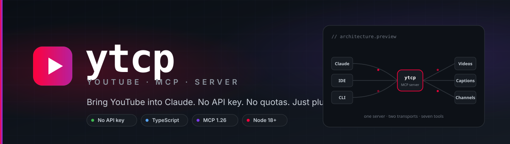
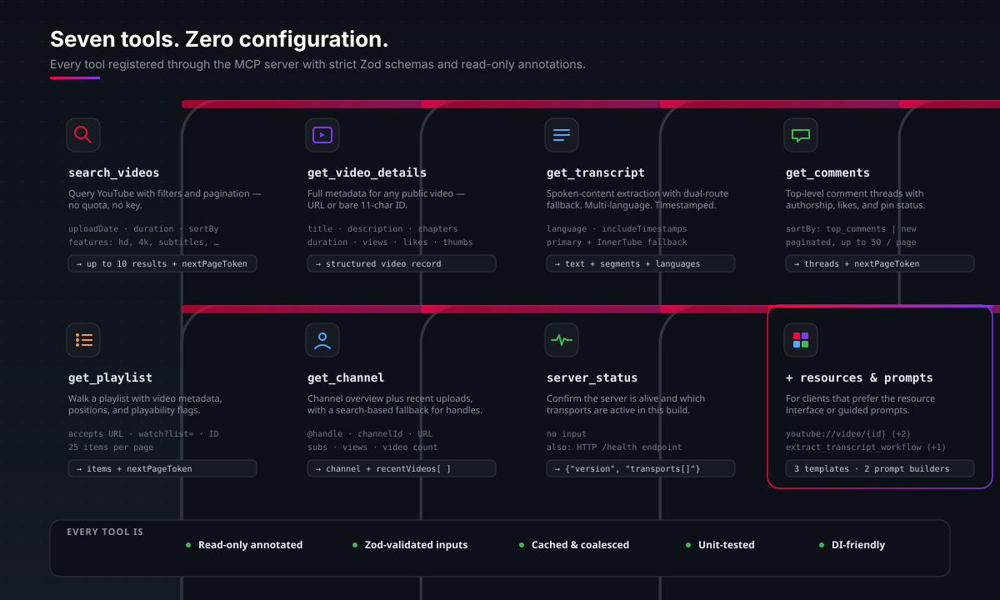
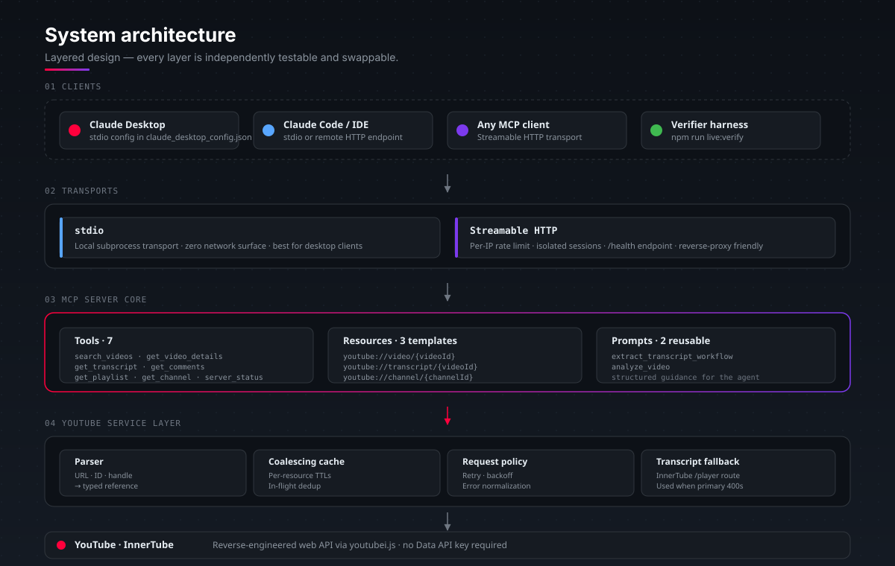
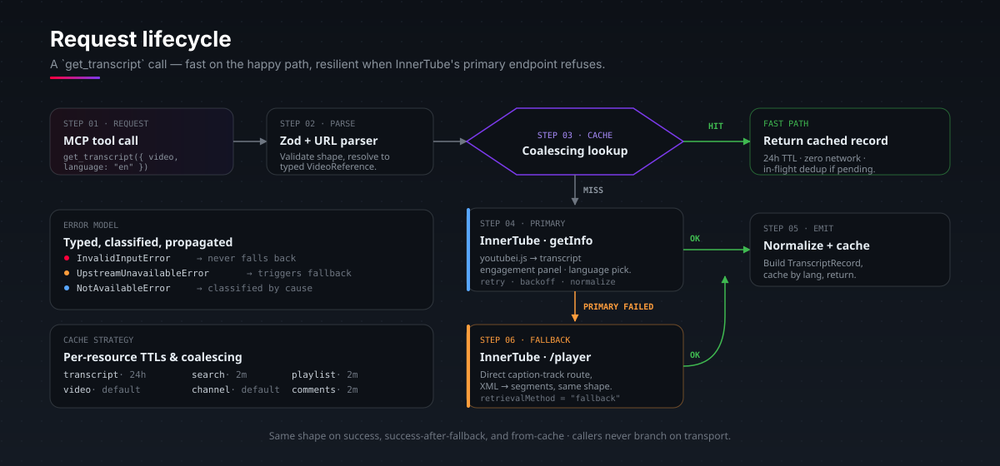

<div align="center">



<p>
  <a href="#quick-start"></a>
  
  
  
  
  
</p>

<sub>A no-API-key Model Context Protocol server that gives Claude — and any MCP client — deep YouTube access:<br/>search, transcripts, comments, playlists, channels, and more.</sub>

</div>

---

## Why ytcp

| | |
|---|---|
| **No API key, no quotas** | Uses [`youtubei.js`](https://github.com/LuanRT/YouTube.js) — the same internal API that powers YouTube's web app. No Google Cloud project, no OAuth, nothing to rotate. |
| **Two transports, one server** | `stdio` for Claude Desktop. Streamable HTTP for remote hosting, IDEs, and custom clients. Same server, same tool surface. |
| **Resilient transcripts** | Primary InnerTube route with an automatic InnerTube `/player` fallback when YouTube's transcript panel 400s. |
| **Built like a service** | Coalescing cache with per-resource TTLs, typed errors, retry policy, Zod-validated inputs, dependency injection, and 50+ unit tests. |

---

## What you can ask Claude

Once connected, Claude treats YouTube as a research surface:

> *"Find the best talks on Rust async programming from the last year, sorted by views."*

> *"Get the full transcript of this video and turn it into a numbered checklist."*

> *"What are the top comments on this video? What's the audience reaction?"*

> *"Walk me through this 3-hour talk — give me a chapter-by-chapter summary so I know which parts to watch."*

> *"This tutorial is in Spanish. Pull the transcript and translate the key steps."*

> *"List every video in this playlist and tell me which ones cover database indexing."*

More worked examples in [docs/examples.md](docs/examples.md).

---

## The seven tools



Each tool is registered with strict [Zod](https://github.com/colinhacks/zod) input schemas, returns a normalized response shape, and is annotated `readOnly` for the MCP client to reason about safety.

<details>
<summary><b>Tool signatures (click to expand)</b></summary>

```ts
search_videos({ query, filters?, maxResults?, pageToken? })
  // filters: { uploadDate, duration, sortBy, features }
  // → YouTubeSearchPage { results[], nextPageToken? }

get_video_details({ video })
  // accepts URL, youtu.be, /shorts/, /live/, /embed/, music.youtube.com, or bare 11-char ID
  // → YouTubeVideoRecord { title, description, chapters[], viewCount, ... }

get_transcript({ video, language?, includeTimestamps? })
  // dual-route: InnerTube primary + /player fallback
  // → YouTubeTranscriptRecord { text, segments[], languages[], retrievalMethod }

get_comments({ video, sortBy?, maxResults?, pageToken? })
  // sortBy: "top_comments" | "new_comments"
  // → YouTubeCommentPage { threads[], nextPageToken? }

get_playlist({ playlist, maxResults?, pageToken? })
  // accepts playlist URL, watch?v=&list=, or bare playlist ID
  // → YouTubePlaylistRecord { items[], nextPageToken? }

get_channel({ channel })
  // accepts @handle, channel ID, custom URL, or canonical URL
  // → YouTubeChannelRecord { title, subs, recentVideos[] }

server_status()
  // → { server, version, transports[], readiness }
```

</details>

---

## Architecture



The server is split into five honest layers so each one is independently testable and swappable:

- **Clients** — Claude Desktop, IDEs, or any MCP client that speaks stdio or streamable HTTP.
- **Transports** — `stdio` for desktop, streamable HTTP with per-IP rate limiting and isolated sessions for hosted use.
- **MCP server core** — registers **7 tools**, **3 resource templates**, and **2 reusable prompts** behind a single factory (`createServer`).
- **YouTube service** — parser, [coalescing cache](src/youtube/coalescing-cache.ts), [request policy](src/youtube/policies.ts), and a [transcript fallback adapter](src/youtube/transcript-fallback.ts). Dependency-injected, so tests stub the upstream.
- **InnerTube** — wraps `youtubei.js` and is the only seam that talks to YouTube.

---

## Request lifecycle



The same flow applies to every tool: parse, coalesce on the cache, fast-return on a hit, and on a miss go through a policy-wrapped upstream call before normalizing and storing the result. Transcripts get an extra fallback hop when YouTube's primary endpoint refuses — and the response shape stays identical either way, so clients never branch on transport quirks.

---

## Quick start

### Claude Desktop · stdio

```bash
git clone https://github.com/Vel-o-city/ytcp.git
cd ytcp
npm install
npm run build
```

Open your Claude Desktop config:

- **macOS** — `~/Library/Application Support/Claude/claude_desktop_config.json`
- **Windows** — `%APPDATA%\Claude\claude_desktop_config.json`

Add the `ytcp` entry, using the absolute path to the repo:

```json
{
  "mcpServers": {
    "ytcp": {
      "command": "node",
      "args": ["/absolute/path/to/ytcp/build/transports/stdio.js"]
    }
  }
}
```

Restart Claude Desktop. Then ask:

> *"Check the ytcp server status."*

Step-by-step walkthrough: [docs/claude-desktop-setup.md](docs/claude-desktop-setup.md).

### Remote hosting · streamable HTTP

```bash
YTCP_HTTP_HOST=0.0.0.0 YTCP_HTTP_PORT=3001 npm run live:http
```

The MCP endpoint is exposed at `http://your-host:3001/mcp`. A non-rate-limited `/health` endpoint reports uptime for monitoring.

| Variable | Default | Purpose |
|---|---|---|
| `YTCP_HTTP_HOST` | `127.0.0.1` | Bind address — set `0.0.0.0` for remote |
| `YTCP_HTTP_PORT` | `3001` | TCP port |
| `YTCP_HTTP_PATH` | `/mcp` | URL path for the MCP endpoint |

Production notes (reverse proxy, rate limits, sessions): [docs/http-transport.md](docs/http-transport.md).

### Docker

```bash
docker build -t ytcp .
docker run -p 3001:3001 -e YTCP_HTTP_HOST=0.0.0.0 ytcp
```

The container exposes the streamable HTTP transport on `3001` and runs as a non-root user.

---

## Resources and prompts

Beyond tool calls, ytcp exposes resource templates and reusable prompts so MCP clients can lean on whichever surface they prefer.

```
youtube://video/{videoId}        → compact video metadata
youtube://transcript/{videoId}   → full transcript
youtube://channel/{channelId}    → channel overview
```

```
extract_transcript_workflow → turn a video into steps / bullets / summary
analyze_video               → structured analysis with focus modes
```

---

## Project structure

```
ytcp/
├── src/
│   ├── index.ts                       barrel exports
│   ├── server/
│   │   ├── create-server.ts           McpServer factory
│   │   ├── register-tools.ts          7 tools, Zod schemas, summarizers
│   │   ├── register-resources.ts      youtube://… URI templates
│   │   └── register-prompts.ts        reusable prompt builders
│   ├── transports/
│   │   ├── stdio.ts                   local subprocess transport
│   │   ├── http.ts                    streamable HTTP runtime + sessions
│   │   ├── http-entrypoint.ts         production HTTP entrypoint
│   │   └── rate-limiter.ts            per-IP sliding window
│   ├── youtube/
│   │   ├── service.ts                 orchestration + caching + fallback
│   │   ├── client.ts                  youtubei.js client factory
│   │   ├── parser.ts                  URL / ID / handle parser
│   │   ├── normalize.ts               raw → typed records
│   │   ├── cache.ts                   TTL cache
│   │   ├── coalescing-cache.ts        in-flight request dedup
│   │   ├── policies.ts                retry + backoff + error mapping
│   │   ├── transcript-fallback.ts     InnerTube /player adapter
│   │   ├── contracts.ts               public types
│   │   └── reference.ts               typed YouTube references
│   ├── contracts/
│   │   └── tool-result.ts             MCP result envelope
│   └── lib/
│       ├── logger.ts
│       └── mcp-errors.ts              InvalidInput / NotAvailable / Upstream
├── tests/                             50+ unit tests across layers
│   ├── contracts/
│   ├── server/                        every tool, prompt, and resource
│   ├── transports/                    stdio, HTTP, rate-limiter, live boot
│   └── youtube/                       client, parser, cache, transcripts
├── scripts/live/                      stdio · http · verify-mcp runner
├── docs/                              setup, transport, examples
├── Dockerfile                         multi-stage, non-root
└── .github/workflows/                 CI + Render deploy
```

---

## Tech stack

| Layer | Choice | Why |
|---|---|---|
| Protocol | `@modelcontextprotocol/sdk` 1.26 | First-party MCP server & streamable HTTP transport |
| YouTube | `youtubei.js` 17 | Reverse-engineered InnerTube — no API key, no quotas |
| Captions fallback | `youtube-caption-extractor` | Secondary transcript route when the primary panel 400s |
| Validation | `zod` 3 | Strict, typed input schemas at the tool boundary |
| Runtime | Node ≥ 18, TypeScript 5.8, ESM | Modern target, native fetch, top-level await |
| Tests | `vitest` 3 | Fast watch mode, native ESM, type-aware |
| Container | Multi-stage Dockerfile | Slim runtime image, non-root user |

---

## Development

```bash
npm run dev              # tsx — run without a build step
npm test                 # vitest — unit tests
npm run build            # tsc — emit ./build
npm run live:stdio       # boot stdio transport against real YouTube
npm run live:http        # boot HTTP transport against real YouTube
npm run live:verify      # MCP client harness against both transports
```

The `live:verify` script doubles as an end-to-end smoke test: it speaks the real MCP protocol over both transports, calls every tool, and asserts the response shape — useful before shipping a deploy.

---

## Docs

- [Claude Desktop setup](docs/claude-desktop-setup.md) — local stdio walkthrough with troubleshooting
- [HTTP transport](docs/http-transport.md) — hosting, rate limits, reverse proxy, health checks
- [Example workflows](docs/examples.md) — real prompts and what they do end-to-end

---

## License

MIT.

<sub>Built on the Model Context Protocol. Not affiliated with YouTube or Anthropic.</sub>
